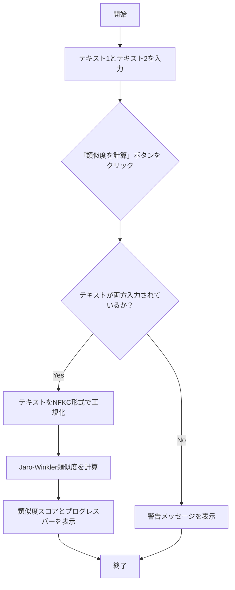

# テキスト類似度計算アプリ


## 概要

このアプリケーションは、入力された2つの日本語テキストの類似度を計算し、表示するツールです。

類似度の計算には、文字列の形状を比較するJaro-Winkler類似度アルゴリズムを用いており、表記の揺れ（例：「ヴァ」と「バ」）に強い判定が可能です。また、比較前にテキストはNFKC形式で正規化されます。

## 主な技術

- Python
- Streamlit
- Jellyfish

## セットアップと実行方法

### 1. リポジリのクローン

```bash
git clone <repository_url>
cd text_similarity_app
```

### 2. 必要なライブラリのインストール

```bash
pip install -r requirements.txt
```

### 3. アプリケーションの起動

```bash
streamlit run app.py
```

ブラウザで表示されたURLにアクセスし、アプリを使用します。

## 使い方

1.  2つのテキストエリアに比較したい文字列を入力します。
2.  「類似度を計算」ボタンをクリックすると、類似度が0から1の範囲で表示されます。

## 処理フロー

